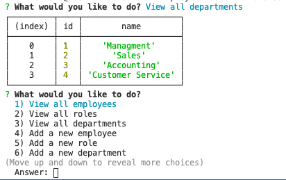

# EmployeeTracker

##Overview
Developers are often tasked with creating interfaces that make it easy for non-developers to view and interact with information stored in databases. Often these interfaces are known as **C**ontent **M**anagement **S**ystems. In this homework assignment, your challenge is to architect and build a solution for managing a company's employees using node, inquirer, and MySQL.

##User Story
As a business owner, I want to be able to view and manage the departments, roles, and employees in my company. So that I can organize and plan my business

##User Instruction
1. Create the database with the schema file
2. Complete an npm i
3. Complete an node server.js
4. Following the prompts in your terminal

##ScreenShot

